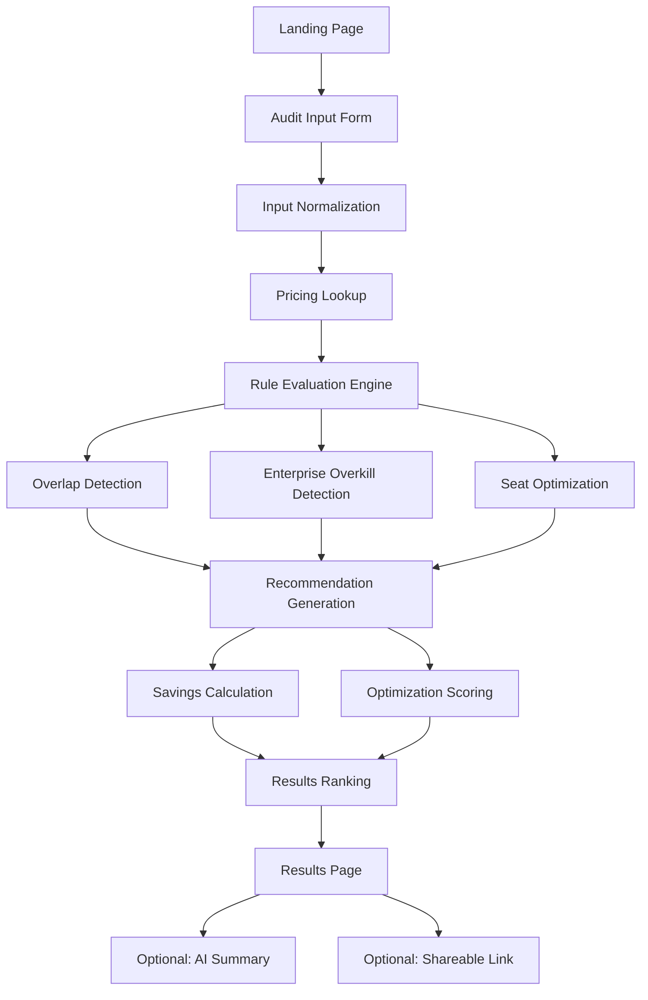

# AIuditor Architecture

## Overview

AIuditor is an AI spend audit platform that helps startups and small teams optimize their spending across AI tools. The system uses **deterministic rule-based logic** to provide financially defensible recommendations.

## Core Principles

### 1. Honesty First
- Never recommend changes just to show savings
- Sometimes the best recommendation is "you're already optimized"
- Provide nuanced, contextual advice

### 2. Deterministic Logic
- All recommendations are rule-based, not AI-generated
- Reproducible and explainable results
- No black-box decision making

### 3. Financial Defensibility
- Every recommendation includes clear reasoning
- Savings calculations are conservative
- Confidence scores reflect uncertainty

### 4. Enterprise Skepticism
- Enterprise plans are NOT automatically better
- Small teams often overpay for unused features
- SSO, SCIM, audit logs rarely needed for < 10 people

## System Architecture



## Data Flow

### 1. User Input
```typescript
{
  tools: [
    {
      toolId: "cursor",
      planId: "cursor-teams",
      monthlySpend: 200,
      seats: 5
    }
  ],
  teamSize: 3
}
```

### 2. Normalization
- Tool names → canonical IDs
- Plan names → canonical IDs
- Category assignment
- Role mapping

### 3. Rule Evaluation
Each rule evaluates independently:
- **Input**: Tool usage + context
- **Output**: Recommendation or null
- **Logic**: Pure functions, no side effects

### 4. Recommendation Generation
```typescript
{
  category: "downgrade",
  severity: "high",
  confidence: 0.9,
  savings: { monthly: 140, annual: 1680 },
  reasoning: "Your team of 3 may not need..."
}
```

### 5. Prioritization
Sort by:
1. Severity (high → medium → low)
2. Monthly savings (highest first)
3. Confidence (highest first)

### 6. Results
```typescript
{
  savings: { current: 200, optimized: 60, savings: 140 },
  score: { overall: 65, rating: "moderate" },
  recommendations: [...]
}
```

## Core Components

### Pricing Configuration (`src/data/pricing.ts`)
**Single source of truth** for all pricing data:
- Tool plans and pricing
- Enterprise features
- Intended audience
- Overlap mappings
- API pricing

**Why centralized?**
- Easy to update when pricing changes
- Consistent across all rules
- Enables programmatic comparisons

### Type System (`src/types/audit.ts`)
Strongly typed interfaces for:
- Tool usage input
- Recommendations
- Audit results
- Overlap analysis
- Optimization scores

### Audit Engine (`src/lib/audit/`)

#### `engine.ts` - Main orchestrator
1. Calculate current spend
2. Evaluate all rules
3. Calculate savings
4. Generate optimization score
5. Prioritize recommendations
6. Return complete audit result

#### `rules.ts` - Rule definitions
Each rule is self-contained:
```typescript
{
  id: "cursor-teams-small-team",
  evaluate: (context) => {
    // Rule logic
    if (condition) {
      return { triggered: true, recommendation: {...} }
    }
    return { triggered: false }
  }
}
```

**Current Rules:**
1. **Cursor Teams Downgrade** - Small teams on enterprise plan
2. **Overlapping Chat Assistants** - ChatGPT + Claude + Gemini
3. **Unused Seats** - Paying for more seats than team size
4. **ChatGPT Team Downgrade** - Small teams on Team plan
5. **Overlapping Coding Assistants** - Cursor + Copilot + Windsurf

#### `overlap.ts` - Overlap detection
- Groups tools by category
- Calculates overlap scores
- Estimates redundancy waste
- Generates consolidation suggestions

#### `scoring.ts` - Optimization scoring
Calculates 0-100 score based on:
- **Plan Efficiency** (30%) - Appropriate plans for team size?
- **Tool Redundancy** (30%) - Overlapping subscriptions?
- **Seat Utilization** (20%) - Unused seats?
- **Enterprise Overkill** (20%) - Unnecessary enterprise features?

#### `calculations.ts` - Financial utilities
- Monthly/annual savings
- Percentage calculations
- Currency formatting
- Safe division (no NaN)

#### `reasoning.ts` - Explanation templates
Deterministic templates for:
- Enterprise downgrade reasoning
- Overlap explanations
- Unused seat messaging
- API optimization advice
- Positive reinforcement

#### `normalization.ts` - Name normalization
Handles variations:
- "ChatGPT Plus" → "chatgpt-plus"
- "GPT Plus" → "chatgpt-plus"
- "chat gpt" → "chatgpt"

## Why Deterministic Rules?

### Advantages
1. **Explainable** - Every recommendation has clear logic
2. **Reproducible** - Same input = same output
3. **Debuggable** - Easy to trace why a recommendation was made
4. **Trustworthy** - No black-box AI making financial decisions
5. **Fast** - No API calls, instant results
6. **Cost-effective** - No LLM API costs

### When to Use AI
AI can enhance (not replace) the audit:
- **Summarization** - Convert recommendations to prose
- **Personalization** - Tailor language to user context
- **Insights** - Identify patterns across many audits
- **NOT for core logic** - Financial decisions stay deterministic

## Common Optimization Patterns

### 1. Enterprise Overkill
**Problem**: Small teams paying for enterprise features they don't use

**Detection**:
- Team size < 5
- Using enterprise/team plans
- Features like SSO, SCIM, audit logs

**Recommendation**: Downgrade to individual plans

**Confidence**: High (0.85-0.95)

### 2. Overlapping Subscriptions
**Problem**: Multiple tools serving the same purpose

**Detection**:
- 2+ tools in same category
- High overlap score
- Similar use cases

**Recommendation**: Consolidate to one primary tool

**Confidence**: Medium (0.65-0.80)

### 3. Unused Seats
**Problem**: Paying for more seats than team members

**Detection**:
- Seats > team size * 1.2
- Per-seat pricing model

**Recommendation**: Reduce seats to match team size

**Confidence**: High (0.80-0.90)

### 4. API vs Subscription
**Problem**: Subscription might be more expensive than API usage

**Detection**:
- Low usage patterns
- API alternative available
- Estimated API cost < subscription cost

**Recommendation**: Evaluate API pricing

**Confidence**: Low-Medium (0.50-0.70)

## Overlap Categories

### Coding Assistants
- Cursor
- GitHub Copilot
- Windsurf

**Overlap**: High (0.7-0.9)
**Reason**: All provide AI code completion and generation

### General Chat Assistants
- ChatGPT
- Claude
- Gemini

**Overlap**: Medium-High (0.6-0.8)
**Reason**: All provide general AI conversation and writing

### API Providers
- OpenAI API
- Anthropic API

**Overlap**: Medium (0.5-0.7)
**Reason**: Similar capabilities, different models

## Confidence Scoring

### High Confidence (0.80-1.0)
- Clear financial waste
- Objective metrics (seats, team size)
- Well-established patterns

**Examples**:
- Unused seats
- Enterprise plan for 2-person team

### Medium Confidence (0.60-0.79)
- Contextual recommendations
- Some assumptions required
- User workflow matters

**Examples**:
- Overlapping tools
- Plan downgrades

### Low Confidence (0.40-0.59)
- Highly contextual
- Depends on specific usage
- Requires user validation

**Examples**:
- API optimization
- Credit opportunities

## Future Enhancements

### Phase 2 (Day 3-4)
- Database integration (Supabase)
- Shareable audit results
- Email capture for leads

### Phase 3 (Day 5-6)
- AI-generated summaries (OpenAI/Anthropic)
- Personalized recommendations
- Historical tracking

### Phase 4 (Post-MVP)
- Real-time pricing updates
- Usage tracking integrations
- Team dashboards
- Industry benchmarking

## Scalability Considerations

### Adding New Tools
1. Add config to `src/data/pricing.ts`
2. Update normalization mappings
3. Add tool-specific rules if needed
4. Update overlap categories

### Adding New Rules
1. Create rule in `src/lib/audit/rules.ts`
2. Add to `ALL_RULES` array
3. Write tests (Day 4)
4. Document in DEVLOG

### Updating Pricing
1. Update `src/data/pricing.ts`
2. No code changes needed
3. Rules automatically use new pricing

## Performance

### Current
- **Audit time**: < 50ms
- **No external API calls**
- **Pure computation**

### At Scale
- Can handle 100+ tools per audit
- Stateless (easy to scale horizontally)
- Cacheable results

## Security & Privacy

### Data Handling
- No data stored (Day 1-2)
- All computation client-side
- No PII required

### Future (Day 3+)
- Optional email capture
- Shareable links (anonymous)
- No usage tracking without consent

## Testing Strategy (Day 4)

### Unit Tests
- Individual rules
- Calculation utilities
- Normalization functions

### Integration Tests
- Full audit flow
- Edge cases
- Boundary conditions

### Test Cases
- Empty input
- Single tool
- All enterprise plans
- All free plans
- Maximum overlap
- Zero overlap
- Unusual team sizes

## Monitoring & Metrics

### Key Metrics (Day 5+)
- Audit completion rate
- Average savings identified
- Recommendation acceptance rate
- Tool distribution
- Plan distribution

### Quality Metrics
- False positive rate
- User feedback
- Recommendation relevance

---

## Summary

AIuditor uses a **deterministic, rule-based approach** to provide honest, financially defensible recommendations for optimizing AI tool spending. The architecture prioritizes:

1. **Transparency** - Clear reasoning for every recommendation
2. **Accuracy** - Conservative savings estimates
3. **Honesty** - Sometimes "no changes needed" is the right answer
4. **Scalability** - Easy to add tools and rules
5. **Performance** - Fast, client-side computation

The system is designed for **startup MVPs**, not enterprise complexity. Every component serves a clear purpose, and nothing is overengineered.
